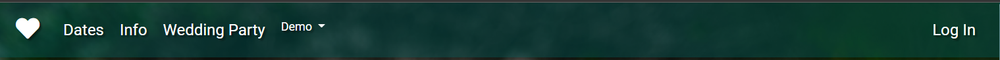
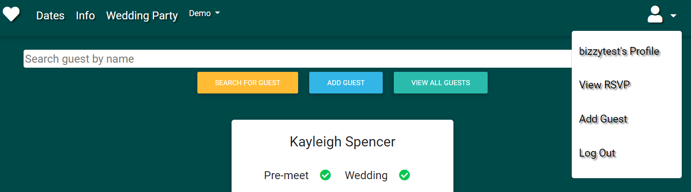
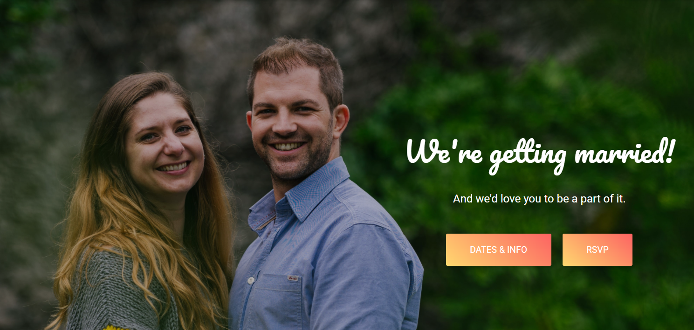
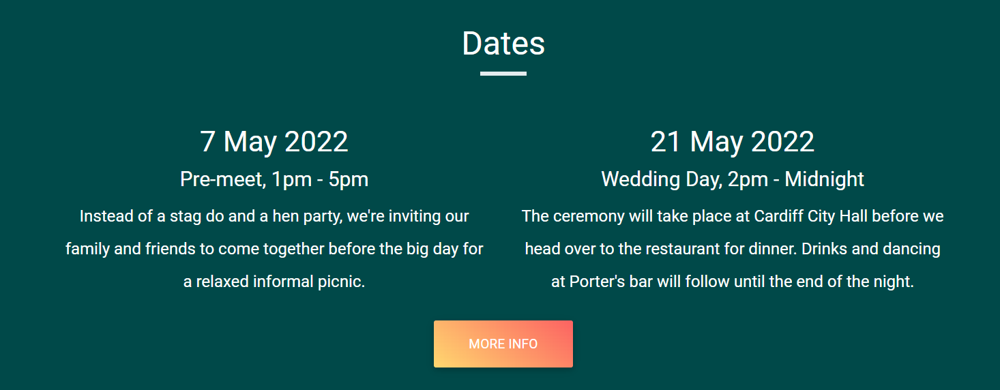
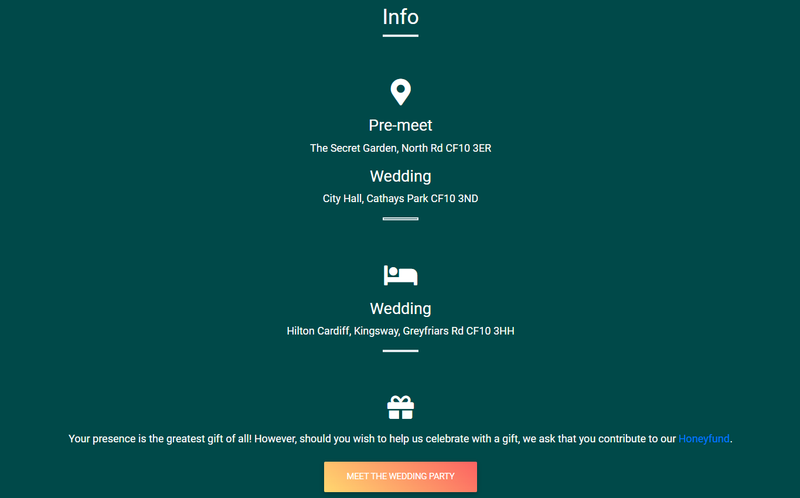
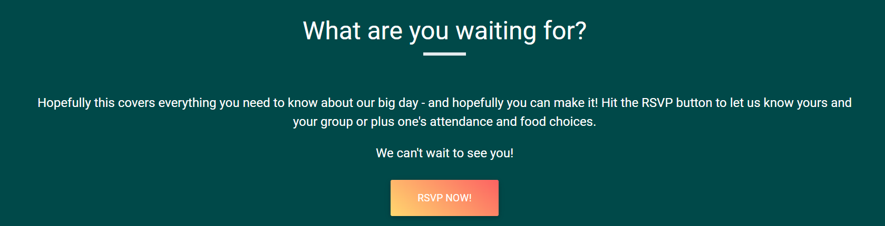
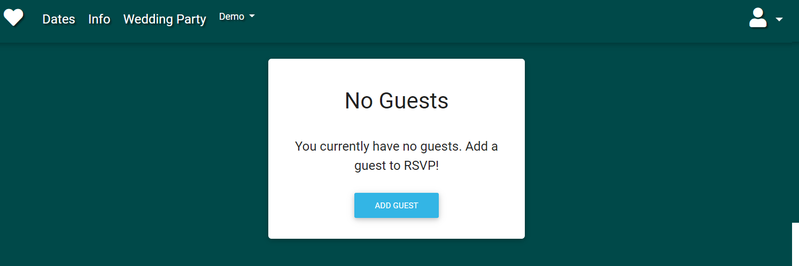
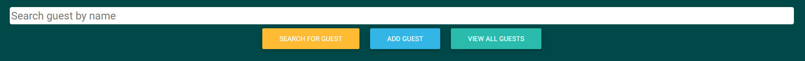

# **Wedding Website RSVP**


## **Goal for this project**

So you're planning your wedding! Congratulations! Did you know that getting married rates in the top 10 of most stressful life events? No? Well you're about to experience it firsthand... 

Take some of the stress out of planning with this easy-to-use, RSVP solution. Get your guests to register their attendance, food options and dietary requirements through a single, user-friendly form integrated with your wedding website. 

Thank you for visiting my project!  
If you have any feedback or questions, head over to my GitHub contact details and feel free to reach out to me.

--- 

<a></a>

## Table of contents 
* [UX](#ux)
    * [User Stories](#user-stories)
        * [First Time Visitor Goals](#first-time-visitor-goals)
        * [Returning Visitor Goals](#returning-visitor-goals)
        * [Frequent Visitor Goals](#frequent-visitor-goals)
    * [Site Owner Goals](#site-owner-goals)
    * [User Requirements and Expectations](#user-requirements-and-expectations)
        * [Requirements](#requirements)
        * [Expectations](#expectations)
    * [Design Choices](#design-choices)
        * [Fonts](#fonts)
        * [Favicon](#favicon)
        * [Colours](#colours)
        * [Structure](#structure)
        * [Imagery](#imagery)
* [Wireframes](#wireframes)
    * [Wireframes](#wireframes)
    * [Database Structure](#database-structure)
* [Roadmap](#roadmap)
    * [Functionality](#functionality)
    * [Existing Features](#existing-features)
    * [Future Features](#future-features)
* [Technologies used](#technologies-used)
    * [Languages](#languages)
    * [Libraries and Frameworks](#libraries-and-frameworks)
    * [Tools](#tools)
* [Testing](#testing)
    * [Approach and Tools](#approach-and-tools)
    * [Validator Testing](#validator-testing)
    * [Bugs and Solutions](#bugs-and-solutions)
* [Deployment](#deployment)
    * [Local Deployment](#local-deployment)
    * [Heroku Deployment](#heroku-deployment)
* [Credits](#credits)

--- 

<a name="ux"></a>

## **UX**

<a></a>

### **User Stories**
#### **First Time Visitor Goals**
* As a first time user, I want to easily understand the purpose of the site.
* As a first time user, I want to easily understand how to use the site.
* As a first time user, I want content to load quickly.
* As a first time user, I want to be able to navigate to the information I need quickly.
* As a first time user, I want to be able to send my RSVP quickly and easily.
* As a first time user, I want to know that my RSVP has been received.

#### **Returning Visitor Goals**
* As a returning user, I want to be able to easily access and review information I've submitted.
* As a returning user, I want to be able to make changes to information I've submitted if I need to.
* As a returning user, I want to be able to RSVP for other guests, e.g. my plus one or family. 

#### **Frequent Visitor Goals**
* As a frequent user, I want to be able to find key information about the wedding day that I will need, e.g. address, schedule etc.
* As a frequent user, I want to know who I can contact directly if there is a problem with the RSVP or I need further information.

<a></a>

### **Site Owner Goals**

* To know who will be attending the wedding.
* To get all guests food options and dietary requirements.
* To get this information in a timely manner at least 2 weeks before the wedding date.
* To have this information in an easily exportable and shareable format.
* To provide guests with information about the wedding. 

[Back to Top](#table-of-contents)

<a></a>


### **User Requirements and Expectations**

<a></a>

#### User Requirements

* Easy to navigate by using the few buttons
* Easy to use RSVP form
* Easy way to add another guest
* Ability to edit and delete existing RSVPs
* Feedback confirming what information has been submitted

<a></a>

#### User Expectations

* When you have multiple guests, it should be easy to navigate between them
* To have a dashboard where all the necessary information is visible
* It should be easy to add another guest 
* It should be easy to edit information submitted
* To be able to search on guest records you've added to edit other guest information

[Back to Top](#table-of-contents)

<a></a>

### **Design Choices**

#### *Fonts*
I selected my fonts from Google fonts. I chose Pacifico, a decorative font, for the header over the hero image. I opted to keep everyting else clean and pared back with Roboto font. 

#### *Favicon*
I selected a favicon for the website from [Favicon](https://favicon.io/).
        
#### *Colours*
The colour scheme for this website was inspired by the greens in the hero image and the flowers/foliage I had chosen for my wedding. 

A a simple website, I opted for just one colour in order to focus the user's attention onto the information. The peach gradient button was selected for its contrast to the green, drawing attention to further information for the user. 

To keep the theme simple, I chose not to differentiate between the call to action RSVP button and the rest. 

#### *Structure*
I have used Bootstrap Material Design with a Bootstrap v4.6 to create the overall structure of my website.

#### *Imagery*
The images are all photographs from my personal albums. If this website was being used as a template for someone else's wedding or event, the user could easily replace the photos with their own.

[Back to Top](#table-of-contents)

---

## **Wireframes**

### **Wireframes**
I used [Balsamic](https://balsamiq.com/wireframes/) to create wireframes for my website. The design of the website evolved as I began to understand how I could achieve what I was aiming for. The forms element in particular changed a lot as I learned more about using Flask.

I had originally envisioned providing the guest with a specific key that enabled them to access a record that was specifically theirs where they could edit their invitation. As demonstrated in the wireframes this would be accessed through a single RSVP form. A separate form would be used for the food choices - originally I designed a multi-step form using SmartWizard. However, I realised this was not an effective way to serve the user and site owner goals and the CRUD functions would be limited.

I made a significant change, ditching the multi-step food choices form and separate RSVP and redesigning a single guest details form that could be used to add or edit a guest. This would be accessible to a user after they had created an account and logged in. The RSVP login form I had originally envisioned was replaced by a standard register/login form. 

The single page website design has had a minor change to the navbar but otherwise the structure remains the same. 

#### Desktop Wireframes
* [Desktop](wireframes/desktop.png)

#### Tablet Wireframes
* [Tablet](wireframes/tablet.png)

#### Mobile Wireframes
* [Mobile](wireframes/mobile.png)

#### Form Wireframes
* [RSVP Form](wireframes/rsvp-form.png)
* [Food Options Form](wireframes/menu.png)
* [Food Options Form (Mobile)](wireframes/menu-mobile.png)

### **Database Structure**

I have used MongoDB to set up the database for this project with the following collections: 

#### **users:**
Information is organised so a single user has a unique id (represented in the code as user_id), username and password.

Key        | Value
-----------|-----------
_id        | ObjectId
username   | String
password   | String

#### **guests:**
Information is organised so a guest has a unique id (represented in the code as guest_id) and then all the relevant information gathered from the form attached to them.

Key                     | Value
------------------------|-----------
_id                     | ObjectId
user_id                 | String
guest_id                | String
full_name               | String
attending_pre_meet      | String
attending_wedding       | String
starter                 | String
main                    | String
dessert                 | String

#### **food_choices:**
Information is organised differently in this collection. The menu choices are each included once, each carrying a unique id. There are three options for the starter and four for each of the mains and desserts. This collection is not editable, instead providing the options for the select inputs on the form. I used a loop to iterate over the options in order to populate the options in the input.

Key             | Value
----------------|-----------
_id             | ObjectId
starter         | String
main            | String
dessert         | String
not required    | String

[Back to Top](#table-of-contents)

---

<a></a>

## **Roadmap**

<a></a>

### **Functionality**

* Register functionality

I created a form where the user can choose a username and a password. I have used the pattern attribute to only allow certain characters for the username and password. Feedback is displayed whenever the user doesn't meet the pattern critera. 

Before creating the new account, the function will check in the database if the username already exists. If so, feedback will be displayed to the user so they can choose another username. The password is stored with the help of the password generate hash so it is stored safely. After the registration is succesful, the user is redirected to the add guest form to add their first guest. 

In case the user mistakenly clicks on register instead of log in, a link to the log in page is provided so the user doesn't have to go back. 

I have also included a 'Go back to the homepage' link so the user doesn't have to use the back button of the browser in case they want to go back to the homepage.

I have used a variable (register) to make the difference between the register and sign-in form. When register is equal to True, text for the register form is displayed. Otherwise, text for the login form is displayed. This means I have just one form for the register and log in functionality. 

* Log in and out functionality

After signing in, the user is redirected to the dashboard where the user can see any guest information they have added. If the user doesn't have any guests added to their profile, they will be redirected to the blank dashboard where a card notes a call to action to add a guest. If they have guests, these are displayed on single cards so the user can quickly the information.

After logging out, the user is redirected back to the login page.

* Add multiple guests per user 

I have created a form with the various input fields where the user can fill in the information to add a new guest. The form is accessed via the 'add guest' button on the dashboard or via the nav link in the dropdown nav bar. There is no limit to the number of guests a user can add.

I have also added a cancel button that allows the user to go back to the dashboard in case the user changes their mind.

* CRUD Functions:
    * Create: add various guests RSVPs with food choices unique to them
    * Read: dashboard where you can view the guest information you've submitted.Each individual guest is displayed as a single card.
    * Update: edit the guest information you've submitted. Users can edit a guest via the 'edit guest' button on the guest card.
    * Delete: delete the guest information you've submitted. YThe user can delete a guest via the 'delete guest' button on the guest card. The button triggers a defensive modal that doublechecks if the user wishes to delete the guest. If yes, the delete button within the modal will delete the guest from the database.

* Search guests by name

The user can search for any guest they have added by name. The search function works on text query and user id to return only guests associated with that user. 

<a></a>

### **Existing Features**

*Navigation*





I opted for a slightly transparent nav bar that is the same colour as the wider theme across the page. The transparency gives it a bit of differentiation across the background when you scroll down, but does not impede the image. 

Hitting the heart icon returns you to the home page and information. Dates and Info nav links take you to the relevant section further down the page. The wedding party link takes you to a new page detailing all the bride and groom family members. The nav remains at the top of the page so that the user can easily navigate back. 

In this iteration, I've included a demo dropdown to demonstrate a custom error page that would appear in the event of a 404 or 500 error.

To the right of the nav bar, the user can opt to log in. The link redirects the user to the login form. 

Once a user is in session the nav bar changes slightly. The log in is replaced by a user icon dropdown which features a disabled nav link displaying the user name and options to view RSVP (directs user to their personal dashboard), add guest (directs user to the add guest form) and log out (ends the user session, pops the username from the nav bar and redirects the user to the log in page)

The navbar is fully responsive, switching to a right aligned burger menu at mobile breakpoint, leaving the heart icon which redirects to the home page on the left.

*Hero Image*



I opted for a 100% width hero image and slightly transparent nav bar in the same colour as the wider theme for a minimalist feel. I added a gradient to the image to bring the brightness down a notch and make the text pop.

I wrote a statement to immediately describe what the website is about ("We're getting married!") and used an eye-grabbing handwriting style font to give it a personal feel. The sentence beneath ("And we'd love you to be a part of it") is a clear indicator to the user the purpose of the website.

Call to action buttons to see information about the event and to RSVP are included in a strong contrasting peach gradient.

The hero image and buttons are responsive. Media queries have been included to realign text and use re-cropped images at specfic break point. The call to action buttons on the hero also redirect the user to different places dependent on whether the user is logged in or not.

*Dates*



The dates section is short but sweet. Information is clearly displayed, white text on plain green background creates good contrast. The user has the option to hit a 'more info' button to trigger a modal which offers further details. A media query shifts the side by side columns to a block display at a certain breakpoint. 

*Info*



The information section offers the user a quick look at basic information indicated by the use of icons - addresses for both events, suggested accommodation and gifts. The snapshot information segways nicely into a button linking through to introductions of the wedding party as further information. This can also be reached via the nav bar.

*What are you waiting for?*



The last section of this website is a reminder of the call to action for the user and a quick link for them to rsvp. If the user isn't logged in, the button links to the register page. If the user is logged in the button directs them to their dashboard.

*Dashboard*




Once the user is logged in, they have access to their own personal dashboard where they can add or edit guests and view their RSVP. If there are no guests added, the dashboard displays a simple card encouraging the user to add a guest to get started.

If the user has guests, each guest and their information is displayed on a single card with the controls to edit or delete them within the card. The edit button redirects the user to th

The user will also have access to dashboard controls which feature an 'add guest' button. The user can also add a guest via a nav link in the user icon nav dropdown in the main nav bar. 

*Dashboard Controls*



The dashboard controls become accessible to the user once they have added a guest. The user will be be able to search for a guest using text search, add a guest using a button or view all guests associated with their account.

*Footer*


The footer is very simple, featuring direct contact details for the site owner.

<a></a>

### **Future Features**

This website template could be used for any type of event. The following features could be added:

*Date Cut Off*

I ran out of time to learn about and include this feature on this particular iteration. However, in a future iteration, disabling the edit and add features by a certain date would be beneficial to the site owner. It would also be beneficial to the to user who would still be able to access their information as a reminder.

*Password/username Reset*

Outside of the scope of the learning for this project is the ability to send a password/user reset email for users who have forgotten their login details. This would be a useful feature to have in a future iteration.

*Further collections for website information*

Again, I ran out of time to include this on this iteration. For a future iteration, it would be beneficial for all changeable website information (e.g. dates, addresses, general content etc.) to be added into a collection on MongoDB. This would mean a future user/site owner would only need to edit information on the database and not in the code, safeguarding against accidental changes.   

[Back to Top](#table-of-contents)

<a></a>

## **Technologies used**

<a></a>

### **Languages**

* [HTML](https://en.wikipedia.org/wiki/HTML)
* [CSS](https://en.wikipedia.org/wiki/Cascading_Style_Sheets)
* [JavaScript](https://en.wikipedia.org/wiki/JavaScript)
* [Python](https://www.python.org/)

<a></a>

### **Libraries and Frameworks**

* [Font Awesome](https://fontawesome.com/)
* [Material Design for Bootstrap](https://mdbootstrap.com/)
* [Google Fonts](https://fonts.google.com/)
* [jQuery](https://jquery.com/)

### **Tools**
* [Git](https://git-scm.com/)
* [GitPod](https://www.gitpod.io/)
* [Heroku](https://www.heroku.com/)
* [Balsamic](https://balsamiq.com/wireframes/)
* [W3C HTML Validation Service](https://validator.w3.org/)
* [W3C CSS Validation Service](https://jigsaw.w3.org/css-validator/)
* [MongoDB Atlas](https://www.mongodb.com/)
* [Flask](https://flask.palletsprojects.com/en/1.1.x/)
* [PyMongo](https://api.mongodb.com/python/current/tutorial.html)
* [Jinja](https://jinja.palletsprojects.com/en/2.11.x/)

[Back to Top](#table-of-contents)

<a></a>

## **Testing**

<a></a>

### **Approach and Tools**

I deployed my website early which meant I was able to test functionality and design as I go. I made regular use of the terminal in my dev environment to pick up and address issues. Pymongo threw useful WSGI error documents which were helpful in debugging. I also used Chrome dev tools to test after each change to ensure expectations met reality / intended application, in particular making use of the network tool to understand silent errors.

Once I had the structure in place, I began testing across other devices. I checked features and formatting across an iPhone 7 and iPhone 10 as well as using dev tools and resizing the browser to check responsiveness. I also used a [free responsive test tool](http://responsivetesttool.com/).

Finally, I posted the deployed site and repo into the peer-review channel on the CI Slack, requesting feedback and I asked friends and family to test the website on their devices. I asked them to make a note of anything they found unusual or that they thought was wrong. This proved particularly helpful for user stories and when considering future features.

<a></a>

### **Validator Testing**
* HTML
    * No errors were returned when passing through [W3C HTML Validation Service](https://validator.w3.org/)

* CSS
    * No errors were returned when passing through [W3C CSS Validation Service](https://jigsaw.w3.org/css-validator/)

* JS
    * No errors were returned when passing through [JShint](https://jshint.com/)

<a></a>

### **Bugs and Solutions**

*Issue*

The delete guest modal wasn't targeting the right specific guest the user was clicking on. Irrespective of the guest the user clicked on, only the first guest in the collection was being returned.

*Solution*

The data attributes weren't aligning between the button and the modal so the modal wasn't receiving a unique guest id everytime. I made sure the data target included the guest id so that it would change everytime, targeting the intended guest.

*Issue*

The delete modal was designed as defensive programming, a step between the user clicking the delete guest button and the guest being deleted. However the actual delete button within the delete guest modal wasn't triggering the function. 

*Solution*

I had placed a form around the whole modal in order to submit the information. I changed this to just be around the delete button but the issue persisted. The issue was solved by removing the form entirely and replacing the buttons in the html with 'a' tags.

*Issue*

When doing a text search for a guest, the function was returning all the results in the database with a partial text match. This meant users were able to see (and edit) other users guests.

*Solution*

I originally explored using the MongoDB $filter method as a solution, aiming to filter the results to only return guests with the session user id attached to them. However, I struggled to understand the syntax. In the end I opted for a more simple solution. I added the user_id as an argument into the find() method. This meant results that were returned were only guests tagged with that user's unique id. 

*Issue*

I created a dynamic, disabled nav link in the nav bar to display the username of the logged in user. However, regardless of the user logged in, the nav link was only returning the name of the first user in the collection.

*Solution*

I realised to be able to show the name of the logged in user in the navbar I'd need to get it from the session in every view for this to work. I looked at Flask context processors to achieve this initally but found a more simple solution. I set the username into session in addition to the user id in the login function. I then made sure to pop the username as well as the user id in the log out function.

[Back to Top](#table-of-contents)

<a></a>

## **Deployment**

### Local Deployment

I have created the Wedding RSVP project using Github, from there I used [Gitpod](https://gitpod.io/) to write my code. 

Then I used commits to git followed by "git push" to my GitHub repository. 

I've deployed this project to Heroku and used "git push heroku master" to make sure my pushes to GitHub were also made to Heroku. 

This project can be run locally by following the following steps: (I used Gitpod for development, so the following steps will be specific to Gitpod. You will need to adjust them depending on your IDE. You can find more information about installing packages using pip and virtual environments [here](https://packaging.python.org/guides/installing-using-pip-and-virtual-environments/)


To clone the project: 

1. From the application's repository, click the "code" button and download the zip of the repository.
    Alternatively, you can clone the repository using the following line in your terminal:

    ``` 
    git clone https://github.com/bizlett/wedding-rsvp.git
    ``` 

2. Access the folder in your terminal window and install the application's [required modules](https://github.com/bizlett/wedding-rsvp/blob/master/requirements.txt) using the following command:

    ```
    pip3 install -r requirements.txt
    ```

3. Sign-in or sign-up to [MongoDB](https://www.mongodb.com/) and create a new cluster
    * Within the Sandbox, click the collections button and after click Create Database (Add My Own Data) called wedding_rsvp
    * Set up the following collections: users, guests and food_choices [Click here to see the exact Database Structure](#database-structure)
    * Under the Security Menu on the left, select Database Access.
    * Add a new database user, and keep the credentials secure
    * Within the Network Access option, add IP Address 0.0.0.0

4. In your IDE, create a file containing your environmental variables called env.py at the root level of the application. 
    
    It will need to contain the following lines and variables:
    ```
    import os

    os.environ["IP"] = "0.0.0.0"
    os.environ["PORT"] = "5000"
    os.environ["SECRET_KEY"] = "YOUR_SECRET_KEY"
    os.environ["DEBUG"] = "True"
    os.environ["MONGO_URI"] = "YOUR_MONGODB_URI"
    os.environ["MONGO_DBNAME"]= "DATABASE_NAME" 
    ```

    Please note that you will need to update the **SECRET_KEY** with your own secret key, as well as the **MONGO_URI** and **MONGO_DBNAME** variables with those provided by MongoDB.

    Tip for your SECRET_KEY, you can use [RandomKeygen](https://randomkeygen.com/) in order to generate a secure secret key. 
    
    To find your MONGO_URI, go to your clusters and click on connect. Choose connect your application and copy the link provided. 
    
    Don't forget to update the necessary fields like password and database name. 

    If you plan on pushing this application to a public repository, ensure that env.py is added to your .gitignore file.

5. The application can now be run locally. In your terminal, type the following command 
    ```
    python3 app.py. 
    ```
    
### To deploy your project on Heroku, use the following steps: 

1. Login to your Heroku account and create a new app. Choose your region. 

2. Ensure the Procfile and requirements.txt files exist are present and up-to-date in your local repository.  
    Requirements:
    ```
    pip3 freeze --local > requirements.txt
    ```
    Procfile:
    ```
    echo web: python app.py > Procfile
    ```

3. The Procfile should contain the following line:
    ```
    web: python app.py
    ```

4. Scroll down to "deployment method"-section. Choose "Github" for automatic deployment.

5. From the inputs below, make sure your github user is selected, and then enter the name for your repo. Click "search". When it finds the repo, click the "connect" button.

6. Scroll back up and click "settings". Scroll down and click "Reveal config vars". Set up the same variables as in your env.py (IP, PORT, SECRET_KEY, MONGO_URI and MONGODB_NAME):
    
    !You shouldn't set the DEBUG variable in under config vars, only in your env.py to prevent DEBUG being active on live website. 

    ```
    IP = 0.0.0.0
    PORT = 5000
    SECRET_KEY = YOUR_SECRET_KEY
    MONGO_URI = YOUR_MONGODB_URI
    MONGO_DBNAME = DATABASE_NAME
    ```

7. Scroll back up and click "Deploy". Scroll down and click "Enable automatic deployment".

8. Just beneath, click "Deploy branch". Heroku will now start building the app. When the build is complete, click "view app" to open it.

9. In order to commit your changes to the branch, use git push to push your changes. 
    

[Back to Top](#table-of-contents)

<a></a>

## **Credits**

<a></a>

### **Code**

* JavaScript to remove blank options in select options - [StackOverflow](https://stackoverflow.com/questions/26009589/remove-blank-option-tag-from-select-list)

<a></a>

### **Media**

* [Cross-Jones Photography](https://www.crossjonesphotography.com/)

<a></a>

### **Acknowledgements**

* [Simen Dahlin](https://github.com/Eventyret) for his support in creating this website
* Student support for being such superstars exploring issues with me, then supporting me to find solutions
* Code Institute Slack Community

[Back to Top](#table-of-contents)
